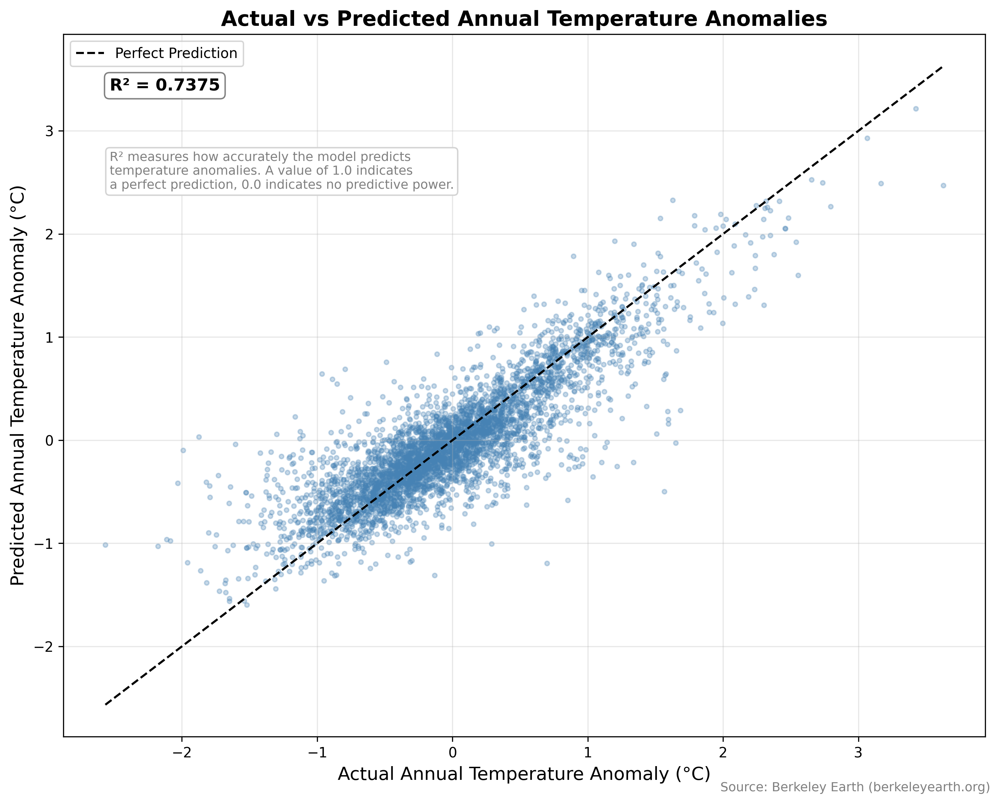

## Solution Description

Using over 250 years of historical temperature data collected from weather stations across the globe, we built a machine learning model that predicts annual temperature anomalies compared to the 1951-1980 historical baseline for 10 countries across 6 continents, consisting of the United States and Canada (North America), Brazil (South America), Germany and Russia (Europe), Nigeria and Egypt (Africa), India and China (Asia), and Australia (Oceania). The visualization below shows the model's predicted temperature anomalies plotted against the actual recorded values — points that fall along the dashed line represent perfect predictions. The tight clustering of points along this line demonstrates that the model accurately captures warming trends across all 10 countries. The model uses these historical trends to predict future anomalies, giving policymakers, humanitarian organizations, and everyday citizens an accessible tool to understand regional warming and plan accordingly. We urge governments and international organizations to use these findings to prioritize climate adaptation funding for the regions warming fastest.

## Chart

